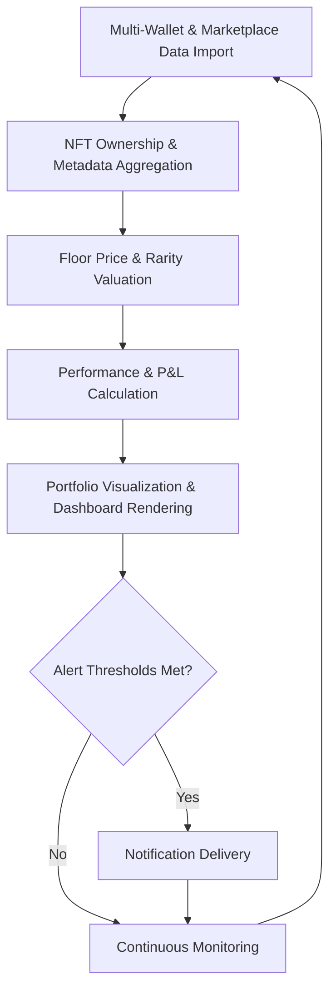

# NFT Portfolio Tracker

Deploy NFT Portfolio Tracker as a real-time NFT collection aggregation and performance analytics execution layer for tracking holdings, floor value, rarity distribution, and trading activity across Ethereum, Solana, and major NFT marketplaces.

### Introduction to NFT Portfolio Management Tools

Managing NFT collections across multiple wallets and chains is complex. An **NFT Portfolio Tracker** functions as a comprehensive **asset aggregation and performance analytics engine** that provides unified visibility into NFT holdings, value, and activity.

Collectors, traders, and investors use these tools to maintain accurate records, analyze performance, and optimize their NFT portfolios.

### Inside the System: Core Mechanism

The tracker operates as a **multi-marketplace and on-chain data importer and valuation layer**. It supports:

- Wallet address monitoring for NFT ownership
- Floor price and rarity-based valuation
- Trading history and P&L calculation
- Collection distribution and trait analysis
- Real-time price feeds and alerts for significant changes

The system normalizes data from different marketplaces into a unified portfolio view with accurate valuation and performance tracking.

### Target Audience and Practical Use Cases

This execution layer targets:
- NFT collectors managing multiple collections
- Traders tracking portfolio performance
- Investors monitoring NFT asset allocation
- Project teams analyzing community holdings

Common applications include:
- **Unified NFT portfolio overview** across chains
- **Floor value and rarity-based valuation**
- **Trading history and P&L tracking**
- **Collection performance comparison**

### Technical Architecture and Operational Logic

A robust NFT Portfolio Tracker includes:

- **Wallet & Marketplace Ingestion Layer**: Address monitoring and marketplace data syncing
- **Asset Valuation Engine**: Floor price and rarity-based calculations
- **Performance Analytics Core**: P&L and activity tracking
- **Visualization Dashboard**: Interactive portfolio views and charts
- **Alert System**: Notifications for significant price or ownership changes

**Operational Logic Flowchart**

### Key Features and Technical Advantages

- **Multi-Chain NFT Support**: Ethereum, Solana, and major ecosystems
- **Real-Time Valuation**: Floor price and rarity-based updates
- **Performance Tracking**: Trading history and P&L metrics
- **Interactive Dashboards**: Visual portfolio overviews
- **Alert Capabilities**: Custom notifications for significant changes

The platform provides unified visibility and analytics for complex NFT portfolios.

### Where It Fits in the Market: Comparison Table

| Aspect                | NFT Portfolio Tracker   | General Crypto Trackers | Basic Marketplace Tools | Manual Spreadsheets  |
|-----------------------|-------------------------|-------------------------|-------------------------|----------------------|
| NFT Focus            | Deep collection analysis| Broad portfolios        | Trading data            | Limited              |
| Real-Time            | Strong                  | Good                    | Good                    | None                 |
| Valuation            | Rarity & floor price    | Market cap              | Basic                   | Manual               |
| Visualization        | Interactive dashboards  | Charts                  | Basic                   | Limited              |
| Best Use Case        | NFT collection management | General crypto tracking | Buying/selling          | Simple tracking      |
| Accessibility        | User-friendly           | Easy                    | Easy                    | Technical            |

### Risk Surface and Limitations

NFT portfolio trackers have practical limitations:
- **Data Accuracy**: Marketplace and on-chain data can have delays or gaps
- **Floor Price Volatility**: Valuations can change rapidly
- **Collection-Specific Logic**: Custom traits or mechanics may require manual adjustment
- **Privacy Trade-off**: Uploading wallet addresses to third-party services
- **Over-Reliance**: Trackers should support, not replace, personal judgment

**Optimization Note**: Cross-reference valuations with multiple marketplaces, maintain awareness of floor price volatility, and use trackers as one tool in broader portfolio management. Regularly verify ownership and activity manually for critical collections.

### Deployment Profile and Getting Started

1. **Tool Selection**: Choose web-based platforms with strong NFT support.
2. **Basic Usage**: Add wallet addresses or collections for tracking.
3. **Dashboard Configuration**: Customize views and set up alerts.
4. **Integration**: Connect to trading tools or notification services.
5. **Advanced Use**: Create custom metrics or export data for further analysis.

Popular web platforms offer intuitive interfaces with no setup required.

### Conclusion

The NFT Portfolio Tracker serves as a powerful asset management execution engine for NFT collectors and traders. Its value lies in unified visibility, real-time valuation, and performance analytics rather than any investment advice. For users seeking clear insights into their NFT holdings across chains, it delivers efficiency and informed decision-making support.

### FAQ

**How accurate are NFT portfolio valuations?**  
They rely on floor prices and rarity metrics, which can be volatile. Use as estimates and cross-reference with actual sales data.

**Does it support Solana and Ethereum NFTs?**  
Yes. Leading trackers integrate with major marketplaces and on-chain data for both ecosystems.

**Can it track multiple wallets?**  
Yes. Users can add multiple addresses for unified portfolio views.

**What are the main limitations?**  
Data delays, floor price volatility, and the need for human judgment in valuation. Use as one tool in a broader strategy.

**How does it compare to general crypto portfolio trackers?**  
NFT-specific trackers provide deeper collection analysis, rarity insights, and marketplace integration that general trackers lack, making them far more powerful for NFT management. Many users use both for comprehensive asset tracking.
